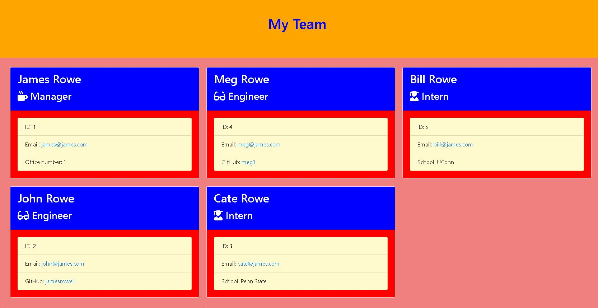

# templateengine

## Project Title

templateengine

## Project Link

- https://github.com/jamesrowe1/templateengine
- https://www.youtube.com/watch?v=qDX6PP2UyB4

## Screenshot

## Getting Started

Begin opening your terminal into the directory this application is stored in. Install node if you do not already have it. Type "npm install" and then allow the packages to be installed. After they are installed, type "node app.js" and then proceed to answer the following prompts. The first set of questions will be in regards to the manager of the group, and then after that you will have the option of adding engineers, interns, or ceasing to enter any more employees.

A HTML document titled "team.html" will be placed in the output folder.

## Prerequisites

You must have node installed in your terminal. Experience with node is suggested.

## Built With

- Visual Studio Code
- JavaScript
- Node
  - File system ("fs")
  - path
- NPM
  - inquirer
  - jest
- Hosted by Github
- Video be Screecastify

## Authors

James Rowe

## License

Licensed under Awesome Coding L.L.C. (not a real company)

## Troubleshooting

For any issues contact James Rowe

## Acknowledgments

- Ben Wright
- Justin Pinero
- Wilson Linares
- Steve Calnan at Trilogy
